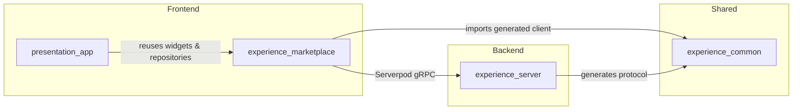
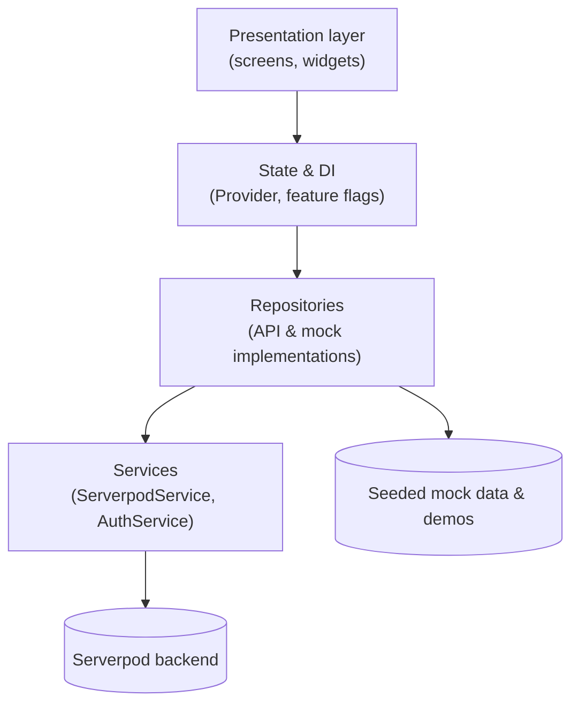

# Flutter Conf LATAM Demo Monorepo

This repository hosts the end-to-end demo showcased at Flutter Conf LATAM. It bundles the Serverpod backend, a Flutter marketplace app, and the live presentation deck into a single workspace so you can run the full stack or reuse individual pieces.

## Packages at a Glance

| Package | Type | Description |
| --- | --- | --- |
| `experience_server` | Serverpod backend | Authenticated API for categories, experiences, and attendance tracking. |
| `experience_common` | Shared Dart package | Generated protocol models and Serverpod client shared by the server and Flutter apps. |
| `experience_marketplace` | Flutter app | Mobile-first marketplace with mock and live data modes, rich animations, and feature flags. |
| `presentation_app` | Flutter app | Slide deck that embeds live marketplace demos and showcases implementation details. |

Additional tooling:

- `codemagic.yaml` configures the CI/CD pipeline that drives automatic builds.
- `experience_marketplace/scripts` contains helper launch scripts for mock, localhost, and hosted backends.

## Live builds

- Presentation deck: https://flutterconflatam-fullstack-dart-demo.codemagic.app/
- Experience marketplace app: https://flutterconflatam-experience-marketplace.codemagic.app/

## Repository Layout

```
.
├── experience_common/            # Shared protocol, generated client, and docs for endpoints
├── experience_marketplace/       # Flutter marketplace app with layered architecture & mock data
├── experience_server/            # Serverpod server, endpoints, migrations, and deployment scripts
├── presentation_app/             # Live presentation deck that reuses marketplace UI and data
├── codemagic.yaml                # CI pipeline definition
└── LICENSE
```

### Module Dependencies



## Architecture Highlights

### Serverpod backend (`experience_server`)
- Configuration lives in `experience_server/config` (`development.yaml`, `staging.yaml`, etc.).
- Data models are declared in `experience_server/lib/src/model` and synchronized to the database through the `migrations/` directory.
- Endpoints inside `experience_server/lib/src/endpoints` enforce authentication (`endpoint_extension.dart`) and expose category, experience, and user APIs.
- Deployment helpers include `cloud-run-deploy.sh` plus Docker and docker-compose files for local orchestration.

### Shared protocol (`experience_common`)
- The generated `experience_common/lib/experience_client.dart` wraps Serverpod RPC stubs consumed by Flutter apps.
- `experience_common/lib/src/protocol/model` houses typed models (e.g., `experience.dart`, `category.dart`) mirrored between server and client.
- `experience_common/doc/endpoint.md` tracks API specifics for quick reference when evolving endpoints.

### Marketplace app (`experience_marketplace`)



Key directories:

- `experience_marketplace/lib/config` controls runtime switches such as mock mode and server URLs.
- `experience_marketplace/lib/core/theme` centralizes design tokens and light/dark theming.
- `experience_marketplace/lib/data/services` wraps integration points (`serverpod_service.dart`, `auth_service.dart`).
- `experience_marketplace/lib/data/repositories` offers both API-backed and offline/demo repositories so the presentation can flip between data sources effortlessly.
- `experience_marketplace/lib/data/providers` exposes feature flags and state via `provider`.
- `experience_marketplace/lib/presentation` contains the actual screens, starting from `presentation/screens/splash` and composing marketplace flows.
- `experience_marketplace/scripts` includes ready-to-run launchers (`run_mock.sh`, `run_localhost.sh`, `run_online.sh`).

### Presentation deck (`presentation_app`)
- `presentation_app/lib/slides` implements each slide as a widget.
- The deck depends on the marketplace package so it can reuse themes, providers, and repositories when demonstrating live features.


## Running the Stack

1. **Backend** – From `experience_server`, run `docker compose up --build --detach` to start Postgres/Redis, then `dart bin/main.dart` to boot Serverpod. Stop with `docker compose stop`.
2. **Marketplace app** – From `experience_marketplace`, choose a script:
   - `experience_marketplace/scripts/run_mock.sh` for fully offline seeded data.
   - `experience_marketplace/scripts/run_localhost.sh` once the local server is up.
   - `experience_marketplace/scripts/run_online.sh` to target a hosted instance.
3. **Presentation deck** – From `presentation_app`, launch with `flutter run`. Keyboard navigation (←, →, space) is wired in `presentation_app/lib/main.dart` for live presenting.

## Development Workflow Tips

- When changing server models, update YAML specs, run `serverpod generate`, and apply migrations before rebuilding the Flutter clients.
- Keep shared DTOs in `experience_common` so both Flutter apps and the server contract stay in sync.
- Use mock repositories during UI prototyping—toggle modes via `ServerConfig.isMockMode` in `experience_marketplace/lib/config/server_config.dart` to avoid needing the backend.

